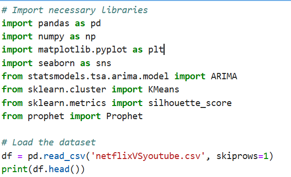
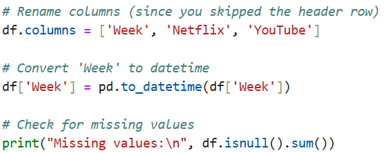

# BIGDATA_FINAL
# Netflix vs YouTube Popularity Analysis During COVID-19 (2019–2021)

## 📌 Problem Statement
This project explores how global interest in Netflix and YouTube evolved during the COVID-19 pandemic using search trend data. The goal was to discover which platform gained more attention over time, especially during lockdown periods, and to explore the patterns using Python and Power BI.

## 📊 Dataset
- **Source**: Google Trends
- **Format**: CSV (Structured)
- **Time Period**: Dec 2018 – Dec 2021
- **Features**: Week, Netflix Interest, YouTube Interest
- **Size**:157 rows x 3 columns
- **Preprocessing**: Removed metadata row, parsed date column, renamed columns for clarity.

## ⚙️ Methodology
- Cleaned dataset (removed metadata row)
- Created visualizations in Power BI
- Calculated yearly sums & averages
- Designed a "Competition Index" to measure relative attention
- Applied K-Means Clustering to segment trend patterns

## 🔍 Key Findings
- YouTube had consistently higher global interest
- Netflix’s popularity surged during 2020 lockdown
- Cluster analysis revealed 3 popularity patterns
- Competition Index peaked in 2020, narrowed in 2021

## 🛠 Tools Used
- Google Trends
- Python (Pandas, Matplotlib, Scikit-learn)
- Power BI

## 🔢 Python Code Snippets
- **Data Cleaning:**
  
  
  
- **Clustering with K-Means:**
  
- **Evaluation (Silhouette Score):**
  
- **ARIMA Forecasting Model:**

- **Forecasting with Prophet:**
  

## 📊 Power BI Dashboard Summary
-**Line Chart:** Weekly interest trends for Netflix and YouTube
- **Bar Chart:** Yearly total search interest by platform
- **Pie Chart:** Distribution of clusters (low/medium/high popularity weeks)
- **Custom Index:** Competition Index showing difference between Netflix and YouTube
- **Filters:** Year and cluster slicers for interactivity

## 📷 Dashboard Preview

## 📅 Key Findings
- YouTube consistently had higher popularity over all years.
- Netflix interest peaked in 2020 during global lockdowns.
- France had the highest concentration of weekly interest values on the map.
- K-Means clustering revealed three main categories of interest patterns.

## ✨ Innovation
- Designed a **Competition Index** to track attention gap between platforms.
- Applied **K-Means Clustering** to detect natural interest segments.
- Implemented **ARIMA and Prophet models** to forecast future platform popularity trends based on historical data.
  
## ℹ️ How to Use
**1.** Open dashboard.pbix in Power BI Desktop to view interactive dashboard.

**2.** Run the analysis.ipynb notebook in Jupyter or any Python IDE.

**3.** Browse the images folder for dashboard screenshots.

## 👩🏽‍💻 Author
RUREBWAYIRE AMPOZE Ariella
27640
